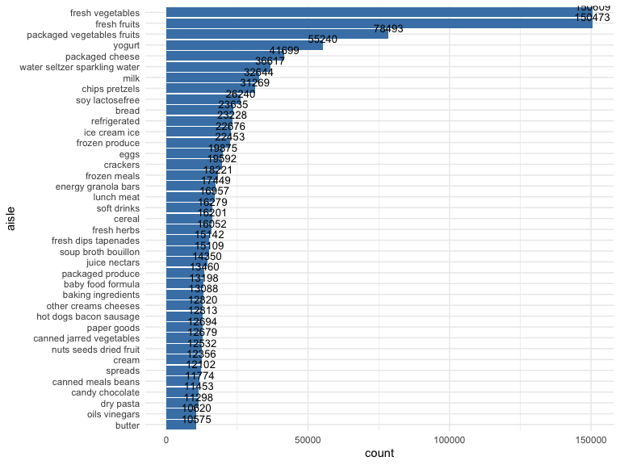
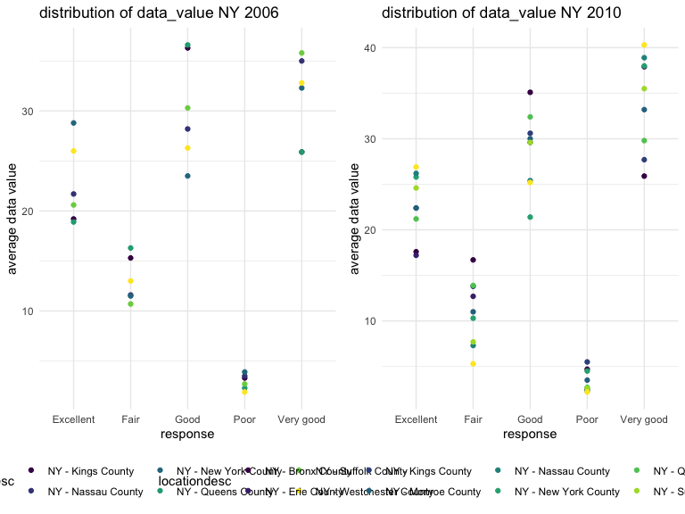
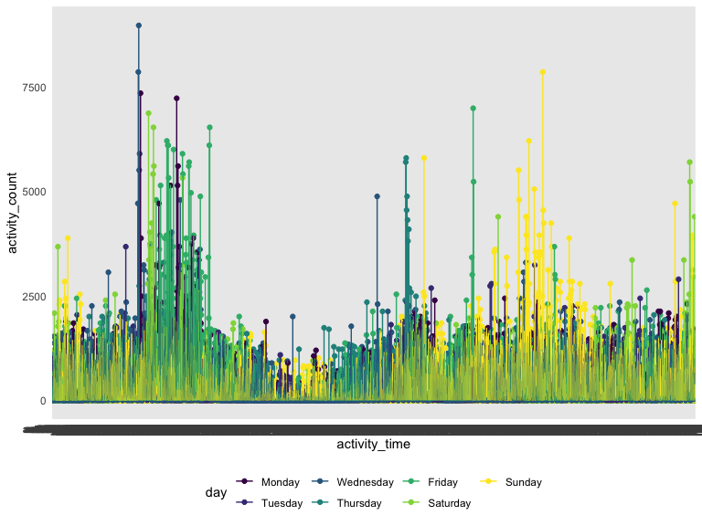

p8105\_hw3\_qy2234
================
Michael Yan
10/10/2019

## general setup

## Problem 1

``` r
#### load the data
library(p8105.datasets)
data("instacart")
```

  - The size of the dataset is 1384618 x 15. There are 1384618
    recordings and 15 variables for each recording. The recordings that
    have the same order\_id are from a single order. Some key variables
    include the id of the product ordered, the name of the product
    ordered, the aisle that the product is from, the department that the
    product is from, when the order is submitted in a 24-hour cycle,
    etc. For instanec, the first row shows the item ordered is bulgarian
    yogurt from aisle yogurt, department dairy eggs.

<!-- end list -->

``` r
#### how many aisles are there
how_many_aisles =
  instacart %>%
  summarize(
    n_aisle = n_distinct(aisle))

#### which aisles are the most most items ordered from
most_ordered_aisle =  
  instacart %>%
  group_by(aisle) %>%
  summarize(n = n()) %>%
  arrange(desc(n))
```

  - There are in total 134 aisles and fresh vegetables is the most
    popular one.

<!-- end list -->

``` r
#### filter out all the aisles with more than 10000 items ordered
most_ordered_aisle_ten_k =  
  instacart %>%
  group_by(aisle) %>%
  summarize(count = n()) %>%
  arrange(desc(count)) %>%
  filter(count > 10000)

#### make a plot that shows the number of items ordered in each aisle
most_ordered_aisle_ten_k %>% 
  mutate(aisle = fct_reorder(aisle, count)) %>% 
  ggplot(aes(x = aisle, y = count)) +
  geom_col(fill = "steelblue") +
  geom_text(aes(label = count), vjust = -0.3, size = 3.5) +
  coord_flip() +
  theme_minimal()
```



``` r
#### make a table showing the three most popular items in three aisles
top_three_baking_ingredients = 
  instacart %>%
  select(product_name, aisle) %>% 
  filter(aisle == "baking ingredients") %>%
  group_by(product_name) %>%
  summarize(count = n()) %>%
  arrange(desc(count)) %>% 
  top_n(3) %>% 
  mutate(rank = seq(1, 3)) 
```

    ## Selecting by count

``` r
top_three_dog_food_care = 
  instacart %>%
  select(product_name, aisle) %>% 
  filter(aisle == "dog food care") %>%
  group_by(product_name) %>%
  summarize(count = n()) %>%
  arrange(desc(count)) %>% 
  top_n(3) %>%
  mutate(rank = seq(1, 3)) 
```

    ## Selecting by count

``` r
top_three_packaged_vegetables_fruits = 
  instacart %>%
  select(product_name, aisle) %>% 
  filter(aisle == "packaged vegetables fruits") %>%
  group_by(product_name) %>%
  summarize(count = n()) %>%
  arrange(desc(count)) %>% 
  top_n(3) %>%
  mutate(rank = seq(1, 3)) 
```

    ## Selecting by count

``` r
top_three_for_baking_and_dog = 
  left_join(top_three_baking_ingredients, 
            top_three_dog_food_care,
            by = "rank")

top_three_for_three_aisles = 
  left_join(top_three_for_baking_and_dog, 
            top_three_packaged_vegetables_fruits,
            by = "rank") %>% 
  select(rank = rank,
         baking_ingredients = product_name.x,
         count = count.x,
         dog_food_care = product_name.y,
         count = count.y,
         packaged_vegetables_fruits = product_name,
        count = count) %>% 
  knitr::kable()
```

``` r
#### make a table showing the mean hour of the day at which Pink Lady Apples and Coffee Ice Cream are ordered on each day of the week

#### for pink lady apples
mean_hour_pink_lady_apples_sun = 
  instacart %>%
  select(product_name, order_hour_of_day, order_dow) %>%
  filter(product_name == "Pink Lady Apples", order_dow == "0") %>% 
  mutate(mean_hour = mean(order_hour_of_day, na.rm = TRUE)) %>% 
  select(product_name, week_day = order_dow, mean_hour) %>% 
  distinct() %>%
  top_n(1)
```

    ## Selecting by mean_hour

``` r
mean_hour_pink_lady_apples_mon = 
  instacart %>%
  select(product_name, order_hour_of_day, order_dow) %>%
  filter(product_name == "Pink Lady Apples", order_dow == "1") %>% 
  mutate(mean_hour = mean(order_hour_of_day, na.rm = TRUE)) %>% 
  select(product_name, week_day = order_dow, mean_hour) %>% 
  distinct() %>%
  top_n(1)
```

    ## Selecting by mean_hour

``` r
mean_hour_pink_lady_apples_tue = 
  instacart %>%
  select(product_name, order_hour_of_day, order_dow) %>%
  filter(product_name == "Pink Lady Apples", order_dow == "2") %>% 
  mutate(mean_hour = mean(order_hour_of_day, na.rm = TRUE)) %>% 
  select(product_name, week_day = order_dow, mean_hour) %>% 
  distinct() %>%
  top_n(1)
```

    ## Selecting by mean_hour

``` r
mean_hour_pink_lady_apples_wed = 
  instacart %>%
  select(product_name, order_hour_of_day, order_dow) %>%
  filter(product_name == "Pink Lady Apples", order_dow == "3") %>% 
  mutate(mean_hour = mean(order_hour_of_day, na.rm = TRUE)) %>% 
  select(product_name, week_day = order_dow, mean_hour) %>% 
  distinct() %>%
  top_n(1)
```

    ## Selecting by mean_hour

``` r
mean_hour_pink_lady_apples_thu = 
  instacart %>%
  select(product_name, order_hour_of_day, order_dow) %>%
  filter(product_name == "Pink Lady Apples", order_dow == "4") %>% 
  mutate(mean_hour = mean(order_hour_of_day, na.rm = TRUE)) %>% 
  select(product_name, week_day = order_dow, mean_hour) %>% 
  distinct() %>%
  top_n(1)
```

    ## Selecting by mean_hour

``` r
mean_hour_pink_lady_apples_fri = 
  instacart %>%
  select(product_name, order_hour_of_day, order_dow) %>%
  filter(product_name == "Pink Lady Apples", order_dow == "5") %>% 
  mutate(mean_hour = mean(order_hour_of_day, na.rm = TRUE)) %>% 
  select(product_name, week_day = order_dow, mean_hour) %>% 
  distinct() %>%
  top_n(1)
```

    ## Selecting by mean_hour

``` r
mean_hour_pink_lady_apples_sat = 
  instacart %>%
  select(product_name, order_hour_of_day, order_dow) %>%
  filter(product_name == "Pink Lady Apples", order_dow == "6") %>% 
  mutate(mean_hour = mean(order_hour_of_day, na.rm = TRUE)) %>% 
  select(product_name, week_day = order_dow, mean_hour) %>% 
  distinct() %>%
  top_n(1)
```

    ## Selecting by mean_hour

``` r
mean_hour_pla = 
  rbind(mean_hour_pink_lady_apples_sun, 
        mean_hour_pink_lady_apples_mon,
        mean_hour_pink_lady_apples_tue,
        mean_hour_pink_lady_apples_wed,
        mean_hour_pink_lady_apples_thu,
        mean_hour_pink_lady_apples_fri,
        mean_hour_pink_lady_apples_sat) %>% 
  pivot_wider(
    names_from = week_day,
    values_from = mean_hour) %>%
  select(product_name,
         sunday = "0",
         monday = "1",
         tuesday = "2",
         wednesday = "3",
         thursday = "4",
         friday = "5",
         saturday = "6") 


#### for coffee ice cream
mean_hour_coffee_ice_cream_sun = 
  instacart %>%
  select(product_name, order_hour_of_day, order_dow) %>%
  filter(product_name == "Coffee Ice Cream", order_dow == "0") %>% 
  mutate(mean_hour = mean(order_hour_of_day, na.rm = TRUE)) %>% 
  select(product_name, week_day = order_dow, mean_hour) %>% 
  distinct() %>%
  top_n(1)
```

    ## Selecting by mean_hour

``` r
mean_hour_coffee_ice_cream_mon = 
  instacart %>%
  select(product_name, order_hour_of_day, order_dow) %>%
  filter(product_name == "Coffee Ice Cream", order_dow == "1") %>% 
  mutate(mean_hour = mean(order_hour_of_day, na.rm = TRUE)) %>% 
  select(product_name, week_day = order_dow, mean_hour) %>% 
  distinct() %>%
  top_n(1)
```

    ## Selecting by mean_hour

``` r
mean_hour_coffee_ice_cream_tue = 
  instacart %>%
  select(product_name, order_hour_of_day, order_dow) %>%
  filter(product_name == "Coffee Ice Cream", order_dow == "2") %>% 
  mutate(mean_hour = mean(order_hour_of_day, na.rm = TRUE)) %>% 
  select(product_name, week_day = order_dow, mean_hour) %>% 
  distinct() %>%
  top_n(1)
```

    ## Selecting by mean_hour

``` r
mean_hour_coffee_ice_cream_wed = 
  instacart %>%
  select(product_name, order_hour_of_day, order_dow) %>%
  filter(product_name == "Coffee Ice Cream", order_dow == "3") %>% 
  mutate(mean_hour = mean(order_hour_of_day, na.rm = TRUE)) %>% 
  select(product_name, week_day = order_dow, mean_hour) %>% 
  distinct() %>%
  top_n(1)
```

    ## Selecting by mean_hour

``` r
mean_hour_coffee_ice_cream_thu = 
  instacart %>%
  select(product_name, order_hour_of_day, order_dow) %>%
  filter(product_name == "Coffee Ice Cream", order_dow == "4") %>% 
  mutate(mean_hour = mean(order_hour_of_day, na.rm = TRUE)) %>% 
  select(product_name, week_day = order_dow, mean_hour) %>% 
  distinct() %>%
  top_n(1)
```

    ## Selecting by mean_hour

``` r
mean_hour_coffee_ice_cream_fri = 
  instacart %>%
  select(product_name, order_hour_of_day, order_dow) %>%
  filter(product_name == "Coffee Ice Cream", order_dow == "5") %>% 
  mutate(mean_hour = mean(order_hour_of_day, na.rm = TRUE)) %>% 
  select(product_name, week_day = order_dow, mean_hour) %>% 
  distinct() %>%
  top_n(1)
```

    ## Selecting by mean_hour

``` r
mean_hour_coffee_ice_cream_sat = 
  instacart %>%
  select(product_name, order_hour_of_day, order_dow) %>%
  filter(product_name == "Coffee Ice Cream", order_dow == "6") %>% 
  mutate(mean_hour = mean(order_hour_of_day, na.rm = TRUE)) %>% 
  select(product_name, week_day = order_dow, mean_hour) %>% 
  distinct() %>%
  top_n(1)
```

    ## Selecting by mean_hour

``` r
mean_hour_cic = 
  rbind(mean_hour_coffee_ice_cream_sun, 
        mean_hour_coffee_ice_cream_mon,
        mean_hour_coffee_ice_cream_tue,
        mean_hour_coffee_ice_cream_wed,
        mean_hour_coffee_ice_cream_thu,
        mean_hour_coffee_ice_cream_fri,
        mean_hour_coffee_ice_cream_sat) %>% 
  pivot_wider(
    names_from = week_day,
    values_from = mean_hour) %>%
  select(product_name,
         sunday = "0",
         monday = "1",
         tuesday = "2",
         wednesday = "3",
         thursday = "4",
         friday = "5",
         saturday = "6") 

mean_hour_pla_cic = 
  rbind(mean_hour_pla,
        mean_hour_cic) %>%
  knitr::kable()
```

## Problem 2

``` r
#### load the data
library(p8105.datasets)
data("brfss_smart2010")

#### data cleaning
excellent_health = 
  brfss_smart2010 %>%
  janitor::clean_names() %>%
  filter(topic == "Overall Health") %>%
  filter(response == "Excellent")

very_good_health = 
  brfss_smart2010 %>%
  janitor::clean_names() %>%
  filter(topic == "Overall Health") %>%
  filter(response == "Very good")

good_health = 
  brfss_smart2010 %>%
  janitor::clean_names() %>%
  filter(topic == "Overall Health") %>%
  filter(response == "Good")

fair_health = 
  brfss_smart2010 %>%
  janitor::clean_names() %>%
  filter(topic == "Overall Health") %>%
  filter(response == "Fair")

poor_health = 
  brfss_smart2010 %>%
  janitor::clean_names() %>%
  filter(topic == "Overall Health") %>%
  filter(response == "Poor")

excellent_to_poor = 
  rbind(excellent_health,
        very_good_health,
        good_health,
        fair_health,
        poor_health) %>% 
  mutate(response = recode(response, "Excellent" = "5")) %>%
  mutate(response = recode(response, "Very good" = "4")) %>% 
  mutate(response = recode(response, "Good" = "3")) %>% 
  mutate(response = recode(response, "Fair" = "2")) %>% 
  mutate(response = recode(response, "Poor" = "1")) %>%
  arrange(response) %>% 
  mutate(response = recode(response, "5" = "Excellent")) %>%
  mutate(response = recode(response, "4" = "Very good")) %>% 
  mutate(response = recode(response, "3" = "Good")) %>% 
  mutate(response = recode(response, "2" = "Fair")) %>% 
  mutate(response = recode(response, "1" = "Poor")) %>%
  mutate(response = as.factor(response))
```

``` r
#### which states were observed at 7 or more locations in 2002
states_seven_or_more_2002 = 
  excellent_to_poor %>%
  filter(year == "2002") %>% 
  count(locationabbr) %>% 
  filter(n >= 7)
#### There are in total 36 states that satisfy the condition which include: AZ, CO, CT, DE, FL, GA, HI, ID, IL, IN, KS, LA, MA, MD, ME, MI, MN, MO, NC, NE, NH, NJ, NV, NY, OH, OK, OR, PA, RI, SC, SD, TN, TX, UT, VT, WA

#### which states were observed at 7 or more locations in 2010
states_seven_or_more_2010 = 
  excellent_to_poor %>%
  filter(year == "2010") %>% 
  count(locationabbr) %>% 
  filter(n >= 7)
#### There are in total 45 states that satisfy the condition which include: AL, AR, AZ, CA, CO, CT, DE, FL, GA, HI, IA, ID, IL, IN, KS, LA, MA, MD, ME, MI, MN, MO, MS, MT, NC, ND, NE, NH, NJ, NM, NV, NY, OH, OK, OR, PA, RI, SC, SD, TN, TX, UT, VT, WA, WY
```

``` r
#### make a “spaghetti” plot of this average value over time within a state
q2_df = 
  excellent_to_poor %>%
  filter(response == "Excellent") %>% 
  group_by(year, locationabbr) %>%
  summarize(average_data_value = mean(data_value)) %>%
  ggplot(aes(x = year, y = average_data_value, color = locationabbr)) + 
    geom_point() + geom_line() + 
    theme(legend.position = "bottom")
#### There is a difference in the average data_value across different states even though the response are all excellent.
```

``` r
#### make a two-panel plot
ny_2006 = 
  excellent_to_poor %>%
  filter(locationabbr == "NY", year == "2006") %>%
  group_by(response, locationdesc) %>%
  ggplot(aes(x = response, y = data_value, color = locationdesc)) + 
  geom_point() +
  labs(
    title = "distribution of data_value NY 2006",
    x = "response",
    y = "average data value")

ny_2010 = 
  excellent_to_poor %>%
  filter(locationabbr == "NY", year == "2010") %>%
  group_by(response, locationdesc) %>%
  ggplot(aes(x = response, y = data_value, color = locationdesc)) + 
  geom_point() +
  labs(
    title = "distribution of data_value NY 2010",
    x = "response",
    y = "average data value")
    
ny_2006 + ny_2010
```



``` r
#### It seems the range of average data value for each county from 2006 overlaps with the range of average data value for each county from 2010. However, within different response groups, the rank of different counties varied.
```

## Problem 3

``` r
#### import data and add a varible that distinguish whether the day is a weekday or a weekend
accel_data = 
  read_csv(
  "./data/accel_data.csv") %>%
  janitor::clean_names() %>% 
  mutate(week = as.factor(week)) %>% 
  mutate(day = recode(day, "Monday" = "1")) %>%
  mutate(day = recode(day, "Tuesday" = "2")) %>% 
  mutate(day = recode(day, "Wednesday" = "3")) %>% 
  mutate(day = recode(day, "Thursday" = "4")) %>% 
  mutate(day = recode(day, "Friday" = "5")) %>%
  mutate(day = recode(day, "Saturday" = "6")) %>% 
  mutate(day = recode(day, "Sunday" = "7")) %>%
  mutate(day = as.numeric(day)) %>%
  mutate(
  weekday = case_when(
      day <= 5 ~ "weekday",
      day > 5 ~ "weekend",
      TRUE      ~"")) %>%
  mutate(day = as.factor(day)) %>%
  mutate(day = recode(day, "1" = "Monday")) %>%
  mutate(day = recode(day, "2" = "Tuesday")) %>% 
  mutate(day = recode(day, "3" = "Wednesday")) %>% 
  mutate(day = recode(day, "4" = "Thursday")) %>% 
  mutate(day = recode(day, "5" = "Friday")) %>%
  mutate(day = recode(day, "6" = "Saturday")) %>% 
  mutate(day = recode(day, "7" = "Sunday")) %>%
  mutate(day = as.factor(day))
```

    ## Parsed with column specification:
    ## cols(
    ##   .default = col_double(),
    ##   day = col_character()
    ## )

    ## See spec(...) for full column specifications.

  - The resulting dataset has 35 rows showing the data from 5 different
    weeks and the days in each week. There are in total 1444 columns
    showing week, day\_id, day, weekday, and 1440 observations. Week
    shows which week among the 5 weeks the obervations were from.
    Day\_id is the order that the observations were put into the
    dataset. Day shows which day in a week the observaitons were
    recorded. Weekday indicates whether the day the observation were
    from is a weekday or a weekend. The 1440 observations are the
    activity count of every minute in a 24-hour cycle, starting from
    midnight.

<!-- end list -->

``` r
#### create a table with total activity count for each day in it
total_activity_over_the_day = 
  accel_data %>%
  mutate(total_activity = select(., activity_1:activity_1440) %>% rowSums(na.rm = TRUE)) %>% 
  select(week, day, weekday, total_activity) %>%
  knitr::kable()
```

  - No significant trend was
oberserved.

<!-- end list -->

``` r
#### create a plot that shows the 24-hour activity time courses for each day
accel_data %>% 
  pivot_longer(activity_1:activity_1440, 
               names_to = "activity_time",
               values_to = "activity_count") %>% 
  group_by(week, activity_time) %>%
  ggplot(aes(x = activity_time, y = activity_count, color = day)) + 
  geom_point() + geom_line() +
  theme(legend.position = "bottom")
```


\* There are not a lot of conclusions that we can make based on this
graph. One thing that we can see is that there is one main peak on the
left of the graph. However, such peak does not occur for everyday from
Monday to Sunday. In general, the activity count for that individual
flutuates a lot based on different time points within a single day and
across a week. The patient will have higher risk of congestive heart
failure near the observed peak which means additional attention should
be made in such time intervals.
